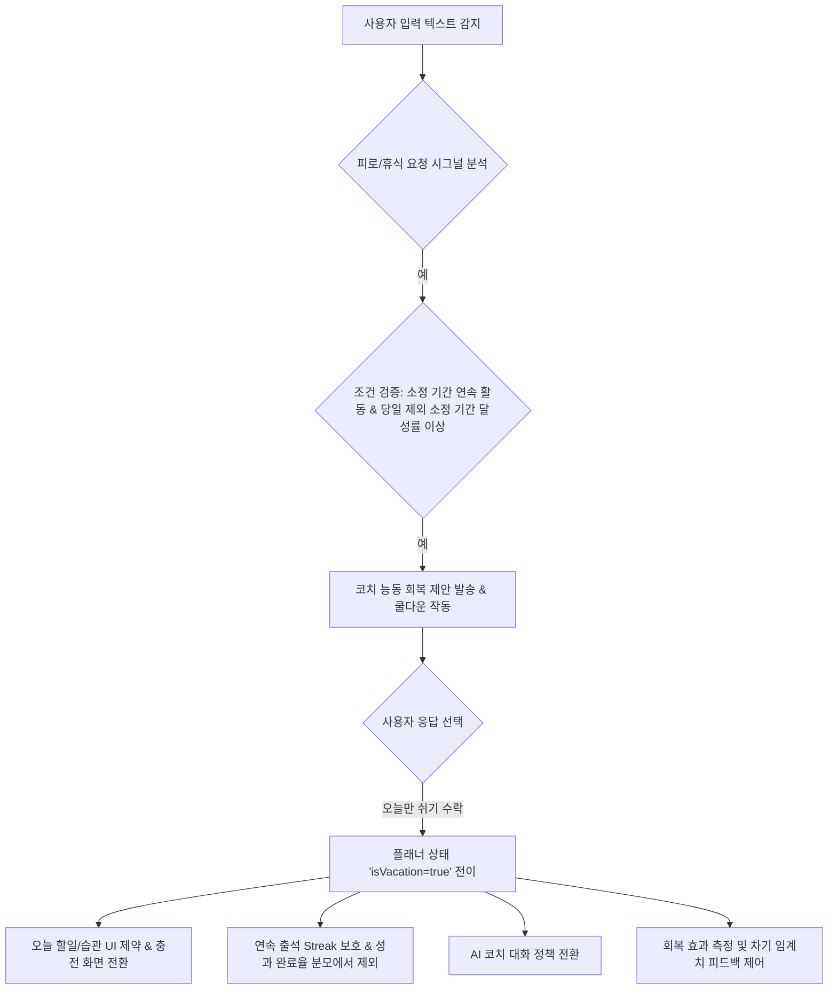

# [특허성 검토 보고서] 번아웃 방지를 위한 코치 능동 개입 및 플래너 제어 시스템

## 1. 개요 (Overview)
- **분석 대상**: 냥냥코치 플래너 내 '번아웃 방지를 위한 코치 능동 개입 알고리즘(회복 제안)' 및 '플래너 상태 전이 제어(휴식 모드 UI/데이터 처리)' 시스템.
- **검토 목적**: 해당 기술의 특허(Software / Business Method Patent) 출원 가능성을 판단하고, 독점 권리 확보를 위한 특허 청구 범위 및 전략 도출.

---

## 2. 특허 대상 핵심 기술 요소 (Key Technical Elements)

현재 앱의 소스 코드(`chat_screen.dart`, `tasks_screen.dart`, `daily_reset_service.dart`) 분석을 바탕으로 도출한 특허 청구 가능한 핵심 발명 요소는 다음과 같습니다.

### [요소 A] 번아웃 방지를 위한 코치 능동 개입 알고리즘 (`_maybeOfferRest`)
- **시그널 분석**: 단순 키워드가 아닌 사용자의 텍스트에서 '피로/휴식 요청 시그널'(`StrongRestSignal`)과 '실행 의지 시그널'(`ExecutionIntent`)을 교차 검증하여 휴식의 진정성을 판별.
- **이력 데이터 검증**: 과거 소정 기간 동안의 연속 활동 일수(Streak)와 **당일을 제외한 직전 소정 기간** 동안의 계획 달성률을 데이터베이스와 실시간 연동해 객관적인 과몰입(번아웃 위험) 상태를 정량적으로 계산. (당일은 계획이 진행 중인 미완성 상태이므로 완료율 왜곡 방지를 위해 연산 대상에서 원천 배제)
- **쿨다운 제어**: 미리 설정된 기준 주기의 개입 제한 플래그를 두어 자동 노티 알림의 피로도를 방지하는 메커니즘.

### [요소 B] 플래너 상태 제어 및 동적 UI 제약 (휴식 모드 전환)
- 사용자가 회복 제안을 수락할 경우 플래너 인스턴스의 상태를 `isVacation = true`로 전이.
- **동적 UI 제약**: 오늘 탭에서 할 일 작성 창, 핵심 할 일 목록, 일반 할 일 리스트의 상호작용을 비활성화(Lock)하고, 이를 '휴식 모드 안내 뷰'로 실시간 동적 변환하는 UI 제어 기술.

### [요소 C] 스트리크 보호 및 완료율 데이터 처리 기술 (`DailyResetService` 연동)
- 회복(휴식)일로 처리된 날에 대해, 기존의 연속 출석일(Streak) 카운트를 깨지 않고 '보존(Keep)'하는 이력 복원 데이터 알고리즘.
- 회복일을 성과 완료율 산정 대상 기간에서 제외하거나, 별도 상태값으로 처리하는 단계.

### [요소 D] 회복 모드 대응 AI 대화 정책 전환 (보강/종속 요소)
- **대화 정책 전환**: 회복 모드 진입(플래너 상태값 `isVacation = true`) 시 AI 코치의 대화 정책을 목표 달성 중심에서 회복 지원 중심으로 전환.
- **압박 표현 억제**: 사용자의 심리적 부담감을 낮추기 위해 업무/성과 압박 표현을 억제하고 죄책감을 해소해 주는 대화 톤 유지.
- **기본 루틴 중심 안내**: 플래너 상태값에 따라 AI 응답 가이드가 동적으로 변경되어, 생산적 행동을 촉구하는 대신 식사, 수분 섭취, 스트레칭 등 건강과 충전을 위한 최소한의 기본 루틴을 유지하도록 유도 및 가이드.
- *(참고: 본 요소는 단독 독립항으로 구성하기보다는 요소 B의 상태 전이에 따른 부가적/종속적 에이전트 제어 보강 요소로 설계하여 종속항에 매핑하는 것이 권리화 관점에서 유리합니다.)*

### [요소 E] 회복 효과 측정을 통한 동적 피드백 제어 시스템 (보강/종속 요소)
- **시계열 데이터 세그멘테이션**: 회복 모드(`isVacation = true`) 활성 시점을 기준점으로 정의하여, 회복 모드 진입 전의 '사전 관찰 윈도우(Pre-vacation Window)'와 회복 모드 해제 후의 '사후 관찰 윈도우(Post-vacation Window)'로 데이터를 분류.
- **생산성 델타 연산**: 두 윈도우 간의 완료 계획 수 및 시간 밀도를 비교 분석하여 회복 기간이 이후 계획 수행력에 미친 정량적 기여도(Productivity Delta)를 산출.
- **동적 임계치 피드백 루프**: 산출된 기여도에 대응하여, 차기 회복 제안 알고리즘(요소 A)의 판별 기준치(임계값)를 동적으로 자율 조정하는 폐루프 제어(Feedback Loop) 기술.

---

## 3. 특허성 평가 (Patentability Evaluation)

| 평가 항목 | 평가 결과 | 세부 판단 근거 |
| :--- | :--- | :--- |
| **신규성 (Novelty)** | **검토 가치 있음** | 기존의 플래너(To-Do App)는 사용자가 등록한 시간에 단순 푸시 알림을 보내거나 일방적으로 입력을 기록하는 정적 시스템에 머물러 있음. 반면, 본 발명은 **사용자의 다이어리 사용 패턴에 근거해 플래너 시스템이 능동적으로 사용자의 계획 수행 여정을 가이드하여 번아웃 방지를 위한 능동적 회복(리차징) 모드를 제공**하는 동적 피드백 시스템이라는 점에서 전 세계 선행기술과의 차별성이 존재하여 검토 가치가 충분함. |
| **진보성 (Inventive Step)** | **보통~우수** | 텍스트 대화에서 피곤하다는 말을 감지해 쉬라고 권장하는 단순 챗봇 기능은 진보성이 부정될 수 있음. 하지만 본 기술은 **사용자의 할 일 완료 이력 DB 연동 + 임계치(Threshold) 검증 + 플래너 상태 전이(`isVacation`) + 통계식 데이터 보정(분모 차감) + 동적 AI 대화 정책 전환 + 회복 효과 피드백 제어 루프**가 하나의 시스템 안에서 유기적이고 밀접하게 동작하여 기술적 난이도를 구성하므로 진보성이 우수함. |
| **기술적 구현성 (BM 특허 요건)** | **구체적 소프트웨어 처리 존재** | 단순히 "인간의 추상적 아이디어(잘 쉬어라)"를 컴퓨터로 모방한 것이 아니라, 데이터베이스(SharedPreferences, Firestore)를 읽어와 수치 알고리즘을 수행하고, 단말기의 특정 뷰(UI Container) 렌더링을 차단 및 전환하며 AI 응답 로직과 통계 피드백 루프를 동적으로 제어하는 구체적인 소프트웨어 처리가 명시되어 있어 특허 적격성을 충족함. |
| **리스크 (Risk)** | **휴식 제안 자체는 공지기술 가능성 있음** | 과거 행동 데이터를 분석해 휴식을 제안하는 단순 로직 자체는 기공개된 특허나 학술지 등 공지기술로 파악될 가능성이 있음. 따라서 출원 시 단순히 '휴식을 권유하는 기능'에 머무르지 않고, 본 발명의 유기적인 **'회복 제안 - 상태 전이 - UI 동적 잠금/전환 - 통계 보정 - 에이전트 대화 가이드 전환 - 데이터 피드백 루프'**의 복합 시스템 청구 구조로 권리범위를 구성하여 리스크를 방어해야 함. |

---

## 4. 특허 청구항(Claims) 구성 전략

권리 범위를 극대화하고 타사 회피를 막기 위해 다음과 같은 다각적인 청구 구조로 출원하는 것을 권장합니다.

1. **독립항 1 (시스템 청구항)**:
   - 사용자의 할 일 완료 이력이 저장된 데이터베이스;
   - 사용자의 피로도 관련 대화 시그널을 수신하는 입력 인터페이스;
   - 상기 완료 이력으로부터 연속 활동일 및 당일을 제외한 직전 소정 기간 동안의 계획 달성률을 연산하고, 미리 설정된 기준값을 만족하고 상기 대화 시그널이 감지된 경우 능동적으로 휴식 모드 전환 버튼을 인앱 칩(Quick Chip) 형태로 표시하는 프로세서;를 포함하는 플래너 시스템.
2. **독립항 2 (방법 청구항)**:
   - 플래너 단말기가 사용자 입력 및 이력을 기초로 번아웃 방지 회복을 권고하는 방법(전체 시퀀스 단계 정의).
3. **종속항 (세부 권리 범위 확보)**:
   - 상기 완료율 연산 시, 당일의 계획 데이터는 완료율 연산 범위에서 원천 제외하는 단계.
   - 사용자가 회복 버튼을 클릭한 것에 대응하여 오늘 할 일 인터페이스를 비활성 상태로 변경하고 휴식 모드 그래픽 뷰를 출력하는 단계.
   - 연속 출석일 계산 시 상기 회복일은 리셋하지 않고 보존하며, 회복일을 성과 완료율 산정 대상 기간에서 제외하거나 별도 상태값으로 처리하는 단계.
   - 미리 설정된 기준 주기의 회복 제안 제한 쿨다운 타이머를 작동시켜 과도한 알림을 제어하는 단계.
   - 플래너의 휴식 모드 상태값에 대응하여 상기 코치 캐릭터(페르소나)의 대화 정책을 목표 달성 가이드에서 회복 지원 가이드(업무/성과 압박 억제 및 기본 웰니스 루틴 유도)로 동적 전환하는 단계.
   - 상기 휴식 모드의 해제 후 소정 기간 동안의 계획 완료율 데이터를 분석하여 회복 효과 기여도를 연산하고, 상기 기여도에 대응하여 차기 휴식 모드 제안의 판별 기준값을 동적으로 조정하는 단계.

---

## 5. 결론 및 실무 권고사항 (Conclusion & Actions)

**본 기술은 충분히 특허 출원 검토 가치가 있는 기술 구성입니다.**

가장 권리 확보에 유리한 강한 핵심 축은 여전히 **회복 제안 → 상태 전이 → UI 제약 → 리포트/스트리크 별도 처리**의 유기적 흐름입니다. 여기에 **AI 대화 정책 전환** 및 **회복 효과 피드백 제어**를 종속/보강 요소로 활용하여 구체적으로 청구항을 보강함으로써 한층 더 제품 형태에 특화되고 권리 범위 확보 가능성을 높일 수 있습니다.

### 성공적인 출원을 위한 Action Item:
1. **시퀀스 다이어그램(Sequence Diagram) 보강**:
   - `ChatScreen` -> `SharedPreferences` -> `DailyResetService` -> `TasksScreen(UI)` 간의 데이터 요청 및 뷰 제어의 물리적 흐름도를 상세히 특허 도면으로 작성해야 합니다.
2. **자연어 처리 알고리즘의 구체화**:
   - `_isVacationActivationRequest` 내부의 다중 정규식 매칭 및 필터링 메커니즘을 '텍스트 전처리 및 키워드 가중치 기반 시그널 매핑 모듈'로 명세서상 구체적인 처리 모듈로 정리하여 명시합니다.
3. **비즈니스 가치**:
   - 사용자의 목표 달성과 웰니스(Mental Care)를 동시에 챙기는 '친화적 비서형 AI 플래너'의 핵심 차별화 특허로서, 향후 경쟁 앱의 유사 기능 복제를 방어하고 기업 가치 평가(기술성 평가) 시 훌륭한 자산이 될 것입니다.
